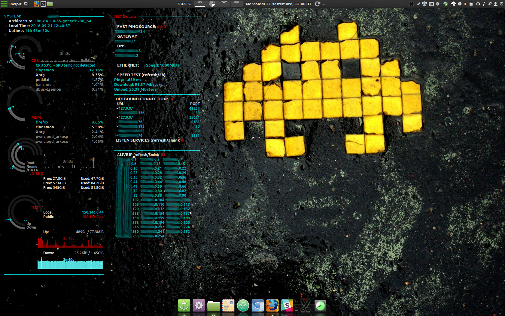

MRH:

conky_cyan from here is copied to /etc/conky/conky.conf
It refers to the lua file here (/home/marcel/software/conky/seamod_rings.lua), for the ring config. 


# Screenshot


# Customization

## Edit the DEFAULTS value in the configuration file "conky_cyan"
## ```template1``` ("wlp3s0") name of the active network interfaces
## ```template2``` ("/DATA") First custom folder to watch other than root.
## ```template3``` ("/Share") Second custom folder to watch other than root.

# Fix and Feature 

## - Fixed syntax for conky version released with Linux Mint 18
## - Fixed visualization distorsion
## - Customized color of some elements, included graph
## - Added a new conky conf for network advanced information and discovery (use conky-manager to have both displayed). Read the EXTRA notes for use it.
## - Parametrized all possible variable (*)
### * SOMEONE smarter than me can discover howto dinamically retrive the name of active interface to make possible to valorize "template1" variable !

# EXTRA
## to use the "conky_netmap" you need:
### ```sudo apt-get install -y fping nmap sockstat```
### ```wget -O speedtest-cli https://raw.github.com/sivel/speedtest-cli/master/speedtest_cli.py && chmod +x speedtest-cli && sudo mv speedtest-cli /bin/```
### ```MY_USER=$(whoami) && echo '# Permission to socket stats' > /tmp/conky_cyan; echo "$MY_USER ALL=NOPASSWD: /usr/bin/sockstat" >> /tmp/conky_cyan;```
### ```sudo chown root. /tmp/conky_cyan; sudo mv /tmp/conky_cyan /etc/sudoers.d/;```
## You can set refresh time in the ```conky_netmap``` using "templateN"

# Many Thanks to the author of the original theme (Green Apple Desktop). You can include my fixes if you wish.
